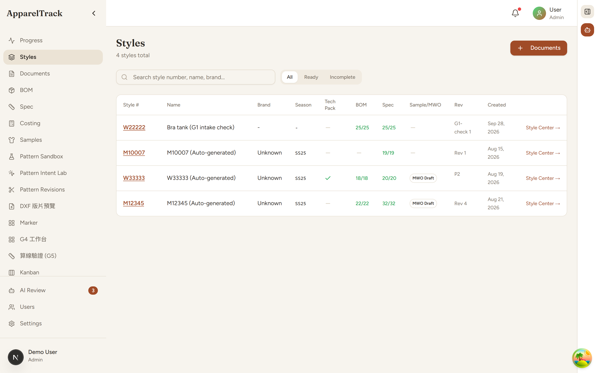
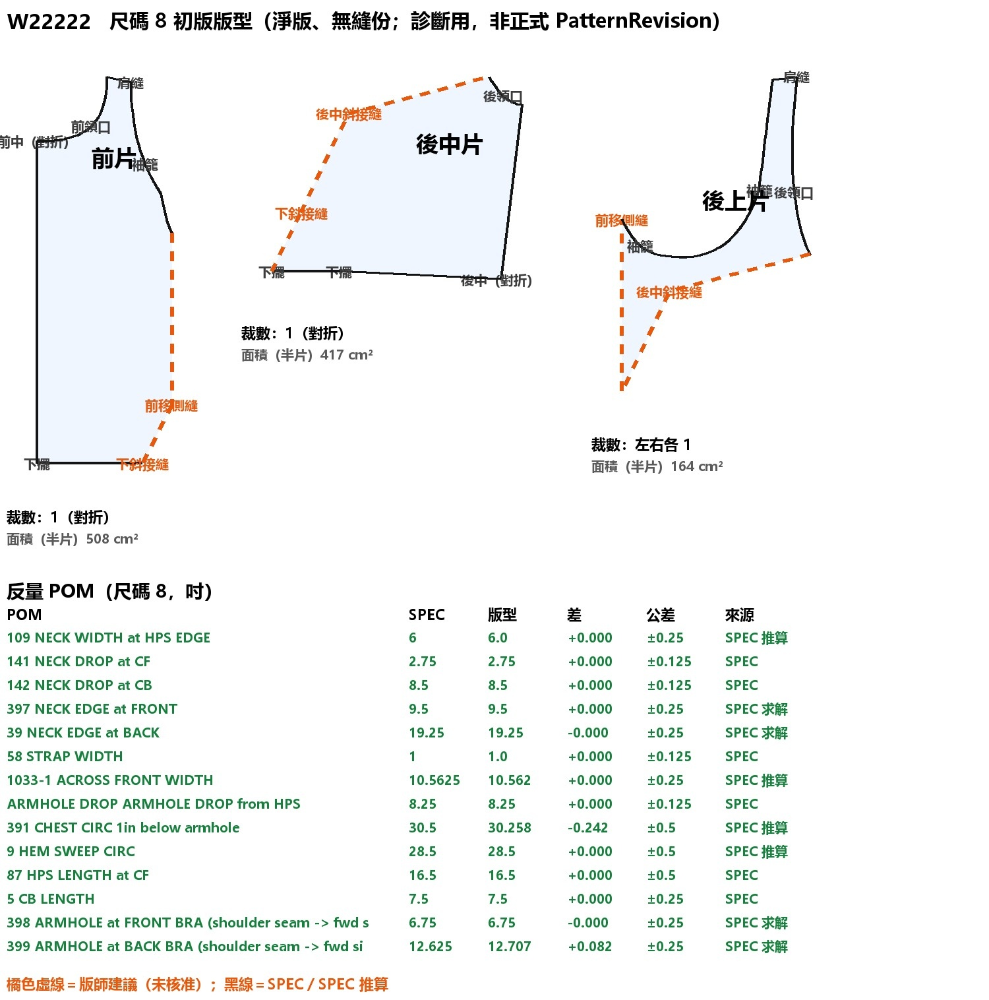

# ApparelTrack

Turn apparel tech packs into structured, traceable production data — in minutes, not hours.

*Every style's tech pack, BOM, size spec and sample status at a glance.*

*Every measurement re-checked on the pattern against the spec, before a sample is cut.*

- **Reads** tech packs, BOMs and size specs, in English and Chinese
- **Traces** every number back to its source page — missing data shows as missing, never guessed
- **Keeps people in control** — AI proposes, people approve

In private development · demo on request

---

© 2026 Amberh2616. All rights reserved. No use, copying or distribution without written permission.
